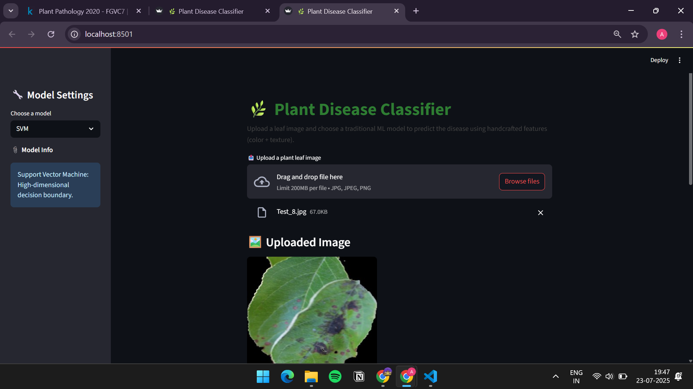
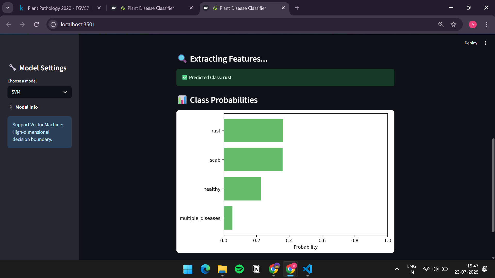

# 🌿 Plant Disease Classifier using Traditional Machine Learning


A powerful image classification app that identifies plant leaf diseases using handcrafted features (color histograms + texture) and traditional machine learning models like SVM, Random Forest, and Gradient Boosting.

---

## 📌 Project Highlights

- 🧠 Uses handcrafted **color and texture features**
- 🔍 No deep learning or transfer learning — 100% traditional ML
- 🧪 Models: **SVM**, **Random Forest**, **Gradient Boosting**
- 📊 Built with **Streamlit** for an interactive frontend
- 📁 Based on the [Plant Pathology 2020 Kaggle Dataset](https://www.kaggle.com/c/plant-pathology-2020-fgvc7)

---

## 📸 Screenshots

### 🏠 Home Page (App Interface)


### 📊 Prediction Results


---

## 🎥 Demo Video

👉 Click to download and view:

[Download Video](demo/project_demo.mp4)

> You can also open it directly in your browser if GitHub supports previewing it.


## 🗂️ Project Structure

```
plant-classifier-traditional-ml/
│
├── data/
│   ├── raw/                  # All original images from Kaggle
│   └── train.csv             # CSV with image IDs and one-hot encoded labels
│
├── features/                 # Extracted feature vectors (auto-generated)
├── models/                   # Trained model files (.pkl)
│
├── utils/
│   ├── data_loader.py        # CSV/image loader functions
│   └── feature_extraction.py # Color histogram & GLCM extraction
│
├── app.py                    # Streamlit web app
├── main.py                   # Training pipeline
├── requirements.txt          # All dependencies
└── README.md                 # You are here!
```

---

## 🚀 Getting Started

### 1️⃣ Clone the Repository

```bash
git clone https://github.com/raushan0422/Plant-classifier-traditional-ml.git
cd Plant-classifier-traditional-ml
```

### 2️⃣ Set up a Virtual Environment

```bash
python -m venv venv
venv\Scripts\activate  # Windows
# OR
source venv/bin/activate  # Linux/macOS

pip install -r requirements.txt
```

---

## 📥 Dataset Instructions

1. Download the dataset from [Kaggle](https://www.kaggle.com/c/plant-pathology-2020-fgvc7)
2. Place `train.csv` inside `data/`
3. Place all images (e.g., `Train_0.jpg`) inside `data/raw/`

---

## ⚙️ Train the Models

```bash
python main.py
```

This will:
- Extract handcrafted features
- Train all three models
- Save them in the `models/` folder

---

## 🎯 Run the Web App

```bash
streamlit run app.py
```

> Your browser will open at: `http://localhost:8501`

---

## 🧠 Model Details

| Model              | Type                  | Strengths                         |
|-------------------|-----------------------|-----------------------------------|
| SVM               | Linear/Kernel SVM     | Works well on high-dim features   |
| Random Forest     | Tree Ensemble         | Handles noise and overfitting     |
| Gradient Boosting | Boosted Trees         | High accuracy on imbalanced data  |

---

## 📌 Example Features Extracted

- 🔹 **Color**: 3D Histogram across RGB channels (8x8x8 bins)
- 🔹 **Texture**: GLCM properties — Contrast, Energy, Correlation, etc.

---

## 👨‍💻 Author

- **Raushan Kumar**
- 💼 Internship Final Project
- 🔗 [GitHub Profile](https://github.com/raushan0422)
